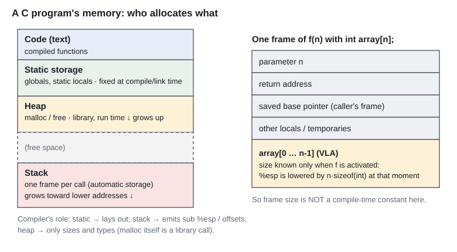
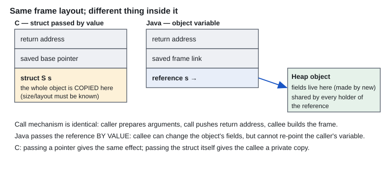

# PoPL Tutorial Question Bank — questions with answers

*Replaces `poplqbank.pdf` and `pre-midsem-practice-questions.pdf` (the two PDFs were byte-identical). Author of the questions: Ramprasad S. Joshi, Oct 2024.*
*There is **no official answer key**. The answers below are reasoned from the course material; the ones marked ✔ were also checked by running code on this laptop (gcc 6.3, 32-bit MinGW).*
*The original numbering skips Q3 — it is missing in the PDF too.*

---

## Q1 — Macro `Permute`, prototype `Exchange`, scope of `a, b, c`

> ```c
> extern void Print(int*);
> #define Permute(a,b,c) {Exchange(a,b,c); Print(a); Exchange(a,b,c); Print(a);}
> extern void Exchange(int *array, int index1, int index2);
> ```
> a) Will the code compile successfully?
> b) Will there be a warning about implicit declaration of function `Exchange` during compilation? Why?
> c) Is the scope of names `a,b,c` lexical or dynamic? Why?

**Say this**
- a) **Yes** — it compiles on its own (`Print` and `Exchange` only need to be *defined* somewhere else at link time). ✔
- b) **No warning**, because a macro body is only text until it is *used*. The prototype of `Exchange` appears after the `#define` but **before** any use of `Permute`, so at the point of expansion `Exchange` is already declared. ✔ (If `Permute(...)` were used *above* the `extern void Exchange` line you would get "implicit declaration".)
- c) **Lexical.** `a, b, c` are macro parameters: the preprocessor replaces them textually, at preprocessing time, with the argument text. After expansion the names are resolved by the ordinary lexical scope rules at the place where the macro is used — nothing depends on the call chain.

**Why / extra**
- A macro has no scope of its own and no types: `Permute(x++, 0, 1)` pastes `x++` four times (evaluated four times). That is the price of text substitution.
- Dynamic scope would mean "look the name up through the chain of callers at run time". C never does that.

---

## Q2 — What if each ASCII character were a token?

> Is it possible to build a parser in this case? What problems will you face?

**Say this** — *Possible in principle, impractical.* It is called **scannerless parsing**: the grammar itself must describe identifiers, numbers, keywords, white space and comments, character by character.

**Problems**
1. **Keywords vs identifiers:** `i`,`n`,`t` could be the identifier `int` or three separate things; without a lexer's "longest match" rule the grammar becomes ambiguous.
2. **Multi-character operators:** `<` vs `<=` vs `<<=` need unbounded look-ahead decisions inside the parser.
3. **White space and comments** must be written into every rule (or the grammar explodes).
4. **Much bigger parse tables, slower parsing**, and the parser can no longer be a simple LL(1)/LR(1) grammar.
5. **Poor error messages** — an error is reported at a character, not at "unexpected identifier".
6. We lose the clean split *lexical level (regular languages) / syntactic level (context-free)* that makes compilers simple. Real compilers use a lexer that groups characters into tokens, then a parser on tokens.

---

## Q4 — Scope of member names in a C `struct`

> Is the scope of member names in a struct in C (a) local to the struct object instance, or (b) local to the block containing the relevant struct object instance, or (c) global?

**Say this** — **(a) is the closest.** Precisely: a member name lives in the **struct type's own member namespace**. It means something only together with a struct value (`s.name` or `p->name`). It is **not** global and **not** tied to the enclosing block.

---

## Q5 — Same member name in two different structs?

> Can we name members in two different structs in C with the same name? If yes, explain how a potential name conflict is avoided or resolved.

**Say this** — **Yes.** Every struct (and union) has its **own member namespace**. The compiler resolves `x.key` / `p->key` using the **static type** of `x` / `p`, then looks `key` up in *that* struct only.

```c
struct A { int key; double a; };
struct B { char *key; int b; };   /* same member name `key` — no conflict */
struct A x; struct B y;
x.key = 1;  y.key = "k";          /* each use is resolved by the type of the left operand */
```
A conflict arises only inside **one** struct (two members with the same name) or through a **macro** named `key`.

---

## Q6, Q7 — The same two questions (Q4, Q5) for C++ and Java

**C++**
- Member names are in **class scope**; two classes may use the same member name. Access is by object/pointer type, or qualified: `A::key`.
- A derived class member with the same name **hides** the base class member; reach the base one with `Base::name`.
- Member *functions* are also **mangled** with the class name (`_ZN1A3fooEv`), so identical function names in different classes do not collide in the linker.

**Java**
- Field and method names are scoped to the **class**; same name in different classes is fine.
- A subclass field with the same name hides the superclass field (`super.x` reaches it). A local variable or parameter shadows a field (`this.x` reaches the field).
- Resolution is by the **static type of the reference** at compile time (methods: dynamic dispatch by the run-time class).

---

## Q8 — Java objects and "a unique symbol-table entry per object"

> To allow call and return by reference, each object created in Java should have a unique entry in the symbol table associated with the running program at runtime. For different objects having the same name, will there be different entries? How are scope rules then enforced?

**Say this** — The premise is not how Java works.
- The **symbol table** is a **compile-time** structure that maps **names to declarations** (types, frame slots). Objects are **not** entered in it.
- At run time an object is identified by its **heap address** (the *reference*). *Variables* have names; *objects* do not.
- Two variables with the same name in different scopes are **different declarations** (different frame slots, possibly pointing to different objects). **Scope rules are enforced at compile time** (lexical scope; Java even forbids a local re-declaring another local of an enclosing block). No run-time scope checks are needed.
- "Call and return by reference" works because a reference value (an address) is copied into the callee's frame — see Q10.

---

## Q9 — Kinds of memory allocation in C and the compiler's role

> Exactly what are the types of memory allocation that the C language offers? What is the role of the C compiler in these mechanisms?



| Kind | Where | Lifetime | Compiler's role |
|---|---|---|---|
| **Static** (globals, `static` locals, string literals) | data / bss segment | whole program | decides size and layout at compile time; linker/loader fixes the addresses |
| **Automatic** (parameters, locals, temporaries, C99 VLA) | stack frame | until the function returns | emits code that lowers the stack pointer at each **procedure activation**; names become offsets from the frame pointer |
| **Dynamic** (`malloc`, `calloc`, `realloc`, `free`) | heap | until `free` | **none** beyond passing `sizeof` and type-checking the pointer — allocation is a **library** (run-time) service |

(`register` is only a hint about where an automatic variable may live.)

---

## Q10 — Java allocates every object on the heap: any difference in activation records from C/C++?



**Say this** — **The frame layout and call mechanism are the same** (arguments, return address, saved frame pointer, locals). What differs is **what an object variable contains**:
- **C/C++**: a struct/class variable *is* the object. Pass it by value and the **whole object is copied into the callee's frame** (its size and layout must be known at the call). Passing a pointer/reference copies only the address.
- **Java**: an object variable holds a **reference** (an address into the heap). The frame holds only primitives and references; the object's fields live on the heap and are shared. Java passes the **reference by value**: the callee can change the object's fields but cannot re-point the caller's variable.

**Rationale:** Java has no by-value object type, so frames are small and uniform, and every object's size need not be known to the caller — at the cost of heap allocation and garbage collection.

---

## Q11 — Allocation type of `scanf("%d",&n); int array[n];`

**Say this** — **Automatic (stack) allocation of a variable-length array (C99 VLA)**, with the size fixed at **procedure-activation time** (when control reaches the declaration), not at compile time.
- The frame size is therefore not a compile-time constant; the compiler emits code that lowers the stack pointer by `n * sizeof(int)` at that point (my assembly check showed `subl %eax, %esp` after reading `n`). ✔ With `n = 5`, `sizeof(array)` printed **20**. ✔
- It is **not** heap allocation: no `malloc`/`free`; storage disappears when the block ends. Too large an `n` overflows the stack.
- In C++ (standard) VLAs do not exist; g++ accepts them only as an extension.
