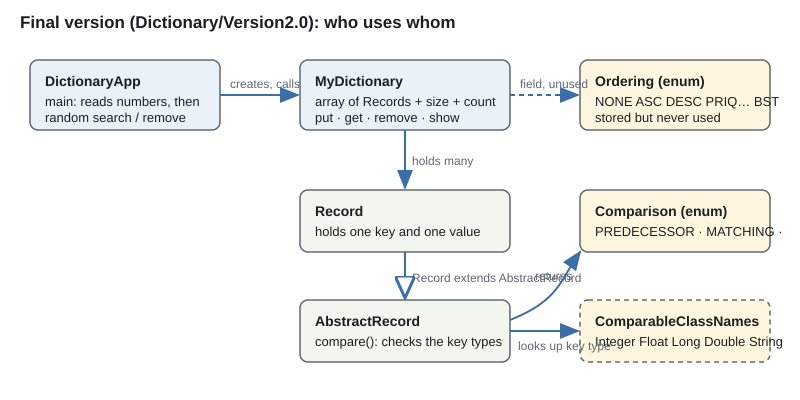

# The Dictionary example — what it is and what it tries to do

*Folder: `05_Code-Examples/Dictionary (2)`. Everything here was read in full, compiled with `javac`, and the final version was run.*

## In one paragraph
This is a small **Java program that stores key–value pairs** (a "dictionary": give a key, get back the record). It is built to be read and changed by students: the code is full of comments that ask questions ("Why is this private?", "What happens if there are duplicate keys?"). It is a **teaching scaffold for data abstraction and object orientation**, not a finished library. The same folder keeps three stages of the program, from a first draft that does not compile to a working final version.

## Why it is in the course
- Slide **p74** of the deck ("A Teaser") sets an exercise: *design a dictionary that guarantees O(log n) insertion, removal, key search and "k-th rank element" retrieval, O(n) sorted listing, and stability* (equal keys come out in first-in-first-out order). This program is the **simple starting point** for that exercise: it stores records in a plain array, so every search and removal is slow (O(n)).
- The `Ordering` type (`NONE, ASC, DESC, PRIQASC, PRIQDESC, BST`) hints at where it is meant to go: sorted array, priority queue, binary search tree. It is declared and stored but **never used**.
- This is my reading from the code and the slide; nothing in the folder says so in words.

## The three stages (folder map)

| Where | What it is | Compiles? |
|---|---|---|
| `Dictionary/` (top level) | **First draft.** `Record` is a fixed class: an `int` key and a `double` value. `AbstractRecord` exists but `Record` does not extend it. | **No.** `MyDictionary.get()` is missing a closing `}` (javac: "illegal start of expression" at `put`). Vim swap files (`.swp`) show it was being edited. |
| `Dictionary_ver2/` (top level) | **Middle step.** Same files as the draft, but `Record` now extends `AbstractRecord` (with a stub `compare()` that prints and returns INCOMPARABLE). Adds `DictionaryApp2.java`, a copy of the final demo that calls `new Record(key, value)`; this middle-step `Record` only has `Record(double)`, so it could not work here anyway. | **No**, same missing `}` in `MyDictionary`. |
| `Dictionary/Version2.0/` and `Dictionary_ver2/Version2.0/` (identical) | **Final version.** Keys and values can be any object; `AbstractRecord.compare()` works out the key type at run time. Includes compiled `.class` files and sample input/output. | **Yes**, and it runs. |

Also here: `geninput.m` (Octave script that makes the test input), `tempInput.txt`, `tempInput2.txt`, `testInput*.txt` (inputs), `tempOutput2.txt` (a saved run), `input0.txt` (a tiny input, `10 4 1 2 3 4`). Many of these files are copies of each other.

## How the final version works

**Storage.** `MyDictionary` keeps `Record[] records` (a fixed-size array), `size` (capacity) and `count` (how many are in use). Both are `private`; the outside world uses `getSize()`, `getLength()`, `isEmpty()`, `isFull()`.

| Operation | What it does | Cost |
|---|---|---|
| `put(record)` | puts the record in the next free slot (`records[count++]`); if full it prints a message and drops it | O(1) |
| `get(key)` | walks the array from the start, compares each record's key with the search key, returns the first match, else `null` | O(n) |
| `remove(key)` | finds the first match, shifts everything after it one place left, decrements `count`, returns the removed record | O(n) |
| `show()` | prints the used records, then one line for the empty slots | O(n) |

**A Record** is just a key and a value (`Object`s). **`AbstractRecord.compare(other)`** is where the interesting idea is: it looks at the *class name* of each key (`Integer`, `Float`, `Long`, `Double`, `String`), refuses to compare keys of different classes (`INCOMPARABLE`), and otherwise calls that class's own `compareTo`. The answer is one of the `Comparison` values: `PREDECESSOR`, `MATCHING`, `SUCCESSOR`, `INCOMPARABLE`.

**`DictionaryApp` (the demo program)**
1. Reads two numbers: the dictionary `size` and how many values to read (`count`).
2. Reads `count` decimal numbers. For each one the **key is the rounded number** (a `Long`), the **value is the original number**. So 3.4 gets key 3, and 3.6 gets key 4. Two values can share a key.
3. Prints the whole dictionary.
4. Repeats random operations until only half the entries remain: with 50% chance it **searches** for a random key between the smallest and largest key, otherwise it tries to **remove** one. It prints what it found (or "N O T H I N G #").

**`geninput.m`** makes the big test file: the header `10000 8000` (size 10000, 8000 values), then 8000 numbers, each a random ratio `rand/rand` with a random sign — values that range from tiny to huge. `tempOutput2.txt` (13,362 lines) is a saved run of that input.

A real run (I ran it): input `8 6` and values `3.4 -1.2 7.9 0.4 3.6 -1.4` printed the six records (keys 3, -1, 8, 0, 4, -1), then began the random phase: it removed key 0 (length 5), searches for keys 6, 5 and 7 found nothing, key 4 was removed, and so on until the length reached 3, half of 6.

## What changed from the first draft to the final version

| First draft | Final version |
|---|---|
| key is a fixed `int`, value a fixed `double` | key and value are any `Object` |
| `get`/`remove` compare with `==` on the int key | compare with `AbstractRecord.compare()`, which looks at the key's class |
| `AbstractRecord` has abstract `key()`, `value()`, `compare()`, `show()` | it has `getKey()`, `getValue()` and a **real** `compare()` plus `toString()`/`show()`; subclasses supply only the two getters |
| demo just fills and prints | demo adds the random search/remove phase |

The point of the change: **the dictionary no longer needs to know what kind of key it holds** — the comparison logic lives in the record, not in the container. That is the data-abstraction idea the course keeps returning to (see the Short answer for "Class design and OO").

## Problems I found by testing the final version
These are real behaviours, useful as "what's wrong with this design" material:

1. **String keys often come out INCOMPARABLE.** `compare()` only understands the results −1, 0 and 1, but `String.compareTo` returns the *difference* (for "apple" vs "cherry" that is a number other than ±1). I ran it: `apple` vs `cherry` gives `INCOMPARABLE`. Only equal strings match correctly.
2. **Keys of unsupported classes crash.** `ComparableClassNames.valueOf(...)` throws `IllegalArgumentException` for, say, a `Character` key instead of answering INCOMPARABLE.
3. **Types must match exactly.** A `Long` key and an `Integer` key with the same number are INCOMPARABLE, so searching with the wrong number type finds nothing.
4. **A stale copy is left behind when the dictionary is full.** After removing from a full dictionary the last slot still holds the old last record (`count` goes down, but the slot is not cleared). `get()` walks the *whole* array, so it can still see it.
5. **Duplicate keys:** `get`/`remove` act on the first match only (the comment in the code asks about exactly this).
6. `get` and `remove` build a throw-away `Record` just to compare against.
7. `ordering` is never used.

## The questions written in the code comments (with short answers)
- *Why is `records` private? Would public work?* It would compile, but outside code could then change or replace the array and break `count`. Private lets the class keep its own rules (information hiding).
- *Why `getSize()` instead of using `size`?* Same reason: read-only access through a method; the field can change its meaning later without breaking users.
- *Why decrement `count`, not `size`?* `size` is the capacity (array length), `count` is how many are in use.
- *What if `++count` replaced `count++` in `put`?* The record would go into slot `count+1`: you would have to start `count` at −1 (or store at `records[count-1]`) and change `show`, `remove`, `isEmpty`, `isFull`, `getLength`, which all assume `count` means "how many".
- *Why a `main` in `MyDictionary` that only prints advice?* It stops people treating the class as a program; it is a library type used from another class's `main` (here `DictionaryApp`).

## Junk you can ignore
`.class` files (compiled output) and the `.swp` files (editor leftovers).
